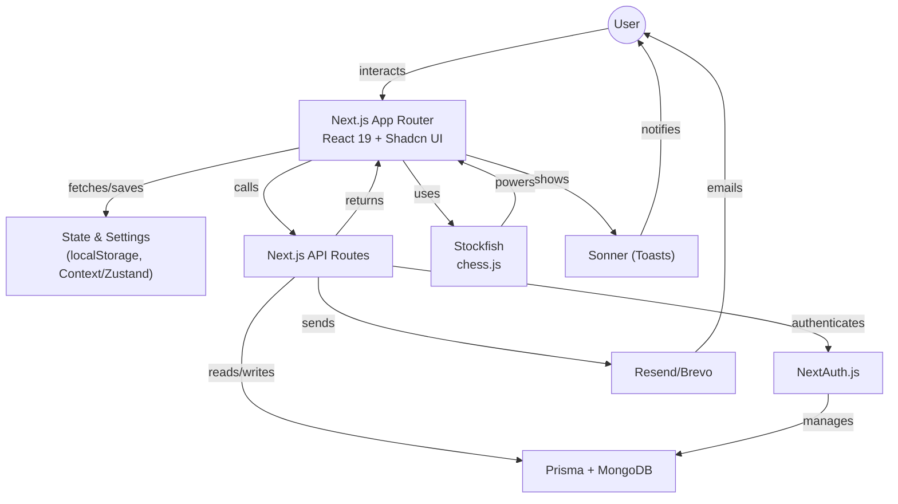

# Next Move - Chess App

A modern chess application built with Next.js, TypeScript, TailwindCSS, Shadcn, Prisma, MongoDB and more.

## Features

- **Play chess against AI opponents** of varying difficulty levels (beginner to Grandmaster equivalent ELO), powered by Stockfish.
- **Drag-and-Drop Chessboard:** Move pieces using drag-and-drop (react-dnd) or click, with support for premoves and pawn promotion modal.
- **Smooth Animations:** Animated piece movement, board highlights, and confetti on victory for an engaging experience.
- **Advanced Chessboard Features:**
  - Move hints, last move highlighting, check/checkmate indicators, and board arrows.
  - Customizable piece sets and board themes.
  - Accessibility features and keyboard navigation.
- **Bot Challenge System:**
  - Play against a variety of AI bots with increasing difficulty and ELO badges.
  - Progression system: defeat bots to unlock harder challenges.
  - Bot selection panel with avatars, tooltips, and random color assignment.
- **Game History & Stats:**
  - Paginated history of all games played, with detailed stats and ELO changes.
  - Wordle and chess stats tracked separately.
  - Ability to clear history and view bot progression.
- **Chess Wordle Mode:** Unique chess-themed Wordle game mode with its own stats and history (accessible as the 9th card on the home page).
- **User Authentication:** NextAuth.js (Google & Email/Password)
  - Email verification with option to resend verification email
  - Secure password reset functionality (link valid for 24 hours)
  - Graceful UX handling for Google OAuth users attempting password reset
  - Automatic deletion of unverified accounts and associated tokens after 7 days for enhanced security
- **Extensive User Settings:**
  - Piece set, board theme, move input method (drag/click/both), sound, confetti, high contrast, auto-queen, coordinates, and more.
  - All settings persist via localStorage and/or user profile.
- **Responsive, Modern UI:**
  - Built with Shadcn UI, Radix, and Tailwind CSS for a mobile-first, accessible experience.
  - Skeleton loaders, tooltips, and interactive feedback throughout.
- **Notifications & Feedback:**
  - Toast notifications (Sonner) for game events, errors, and authentication.
  - Loading spinners and skeletons for async actions.
- **Security & Auth:**
  - NextAuth.js with Google OAuth and email/password, secure password reset, and email verification.

## Tech Stack

- **Frontend**: Next.js 15, React 19, TypeScript
- **UI**: Tailwind CSS (v4), Radix UI, Shadcn UI
- **Styling Utilities**: `clsx`, `tailwind-merge`, `tailwindcss-animate`
- **State Management**: `next-themes` (for theming)
- **Authentication**: NextAuth.js (v4) with Prisma Adapter
- **Database ORM**: Prisma
- **Database**: MongoDB
- **Validation**: Zod with React Hook Form
- **Chess Logic**: chess.js
- **AI Engine**: Stockfish (via `stockfish` npm package)
- **Notifications**: `sonner`
- **Emailing**: `Brevo`
- **Linting/Formatting**: ESLint, Prettier (`prettier-plugin-tailwindcss`)

## Project Structure



## Getting Started

### Prerequisites

- Node.js 18+ and npm/yarn/pnpm
- MongoDB instance (local or cloud-hosted, e.g., MongoDB Atlas)

### Environment Setup

Create a `.env.` file in the root directory by copying `.env.example` (if it exists, otherwise create a new one) and populate the following variables:

```env
# Next Auth
NEXTAUTH_URL=http://localhost:3000 # Your app's URL
NEXTAUTH_SECRET= # Generate a strong secret: openssl rand -hex 32

# Database (MongoDB)
DATABASE_URL="mongodb+srv://<username>:<password>@<cluster-url>/<database-name>?retryWrites=true&w=majority" # Your MongoDB connection string

# Google OAuth (Optional - for Google Sign-In)
# Create credentials at https://console.developers.google.com/apis/credentials
GOOGLE_CLIENT_ID=
GOOGLE_CLIENT_SECRET=

# Email Provider (Resend - for password reset, email verification etc.)
# Sign up at https://resend.com/
RESEND_API_KEY=
EMAIL_FROM="noreply@example.com" # Your "from" email address for Resend

# Optional: Other environment variables as needed by your application
# Example:
# NEXT_PUBLIC_APP_NAME="Next Move"
```

Refer to `prisma/schema.prisma` for understanding the data models.

### Installation

1.  Clone the repository:
    ```bash
    git clone https://github.com/jhn322/next-move.git
    cd next-move
    ```
2.  Install dependencies:
    ```bash
    npm install
    # or
    # yarn install
    # or
    # pnpm install
    ```
3.  Set up the database:

    - Ensure your MongoDB server is running and accessible.
    - Apply Prisma migrations to create the database schema:

    ```bash
    npx prisma migrate dev --name init
    # To generate Prisma Client (usually done automatically by migrate dev, but can be run manually)
    # npx prisma generate
    ```

    Optionally, you can seed the database if a seed script is available (e.g., `npx prisma db seed`). Check `package.json` for any custom seed scripts.

4.  Start the development server:
    ```bash
    npm run dev
    # or
    # yarn dev
    # or
    # pnpm dev
    ```
5.  Open [http://localhost:3000](http://localhost:3000) in your browser.

## Authentication System

The application uses NextAuth.js with the Prisma adapter for authentication, connecting to a MongoDB database. It supports:

- OAuth Google provider.
- Email and password-based sign-up and sign-in, featuring:
  - Mandatory email verification (new users must verify their email).
  - Ability to resend verification emails.
  - Unverified accounts are automatically deleted after 7 days if not verified.
- Secure password reset mechanism for email/password accounts (links expire after 24 hours).
- OAuth Google provider (password reset not applicable/handled gracefully).
- User-friendly notifications for authentication events (e.g., when a Google user tries to reset a password).

User sessions are managed by NextAuth.js, and user data is stored in the MongoDB database as defined in the `prisma/schema.prisma` file. Key models include `User`, `Account`, `Session`, `VerificationToken`, and `PasswordResetToken`.

## Database Schema

The database schema is managed by Prisma and defined in `prisma/schema.prisma`.
Key models include:

- `User`: Stores user profiles, authentication details, and preferences.
- `Account`: Stores OAuth account information linked to users.
- `Session`: Manages user sessions for NextAuth.js.
- `Game`: (Assumed - based on project description, verify in `prisma/schema.prisma`) Stores details of chess games played.
- `PasswordResetToken`: For handling password reset requests.
- `EmailVerificationToken`: For handling email verification requests.

For the exact structure, refer to the `prisma/schema.prisma` file.

## Key Scripts (from package.json)

- `dev`: Starts the Next.js development server with Turbopack.
- `build`: Builds the application for production.
- `start`: Starts the production server.
- `lint`: Lints the codebase using Next.js ESLint configuration.
- `format`: (If defined, typically `prettier --write .`) Formats the code using Prettier.
- `prisma migrate dev`: Applies database migrations during development.
- `prisma generate`: Generates/updates the Prisma Client.

(The user should verify and update this list based on their `package.json`)

## Troubleshooting

### Authentication Issues

- **Incorrect Credentials**: Double-check `GOOGLE_CLIENT_ID`, `GOOGLE_CLIENT_SECRET` if using Google OAuth.
- **`NEXTAUTH_URL`**: Ensure `NEXTAUTH_URL` is correctly set to your application's public URL, especially in Vercel/deployment.
- **`NEXTAUTH_SECRET`**: Make sure a strong `NEXTAUTH_SECRET` is set.
- **Database Connection**: Verify the `DATABASE_URL` is correct and your MongoDB instance is accessible.
- **Prisma Adapter**: Ensure `@auth/prisma-adapter` and `prisma` are correctly configured in `src/lib/auth/options.ts` (or equivalent auth configuration file).

### Database Issues

- **Connection String**: Confirm your `DATABASE_URL` in `.env.local` is correct and the MongoDB server is running.
- **Migrations Not Applied**: Run `npx prisma migrate dev` to ensure your schema is up-to-date with `prisma/schema.prisma`.
- **Prisma Client Not Generated**: Run `npx prisma generate` if you suspect the client is outdated or missing.

### General Development Issues

- **Environment Variables**: Ensure all required environment variables in `.env.local` are correctly set.
- **Dependencies**: Run `npm install` (or yarn/pnpm) if you encounter module not found errors.
- **Turbopack/Next.js Issues**: Consult the Next.js and Turbopack documentation for specific errors.

## Acknowledgements

- [Next.js](https://nextjs.org/)
- [Prisma](https://www.prisma.io/)
- [MongoDB](https://www.mongodb.com/)
- [NextAuth.js](https://next-auth.js.org/)
- [Tailwind CSS](https://tailwindcss.com/)
- [Radix UI](https://www.radix-ui.com/)
- [Shadcn UI](https://ui.shadcn.com/)
- [chess.js](https://github.com/jhlywa/chess.js)
- [Stockfish](https://stockfishchess.org/)
- [Zod](https://zod.dev/)
- [React Hook Form](https://react-hook-form.com/)
- [Resend](https://resend.com/)
- [Sonner](https://sonner.emilkowal.ski/)
